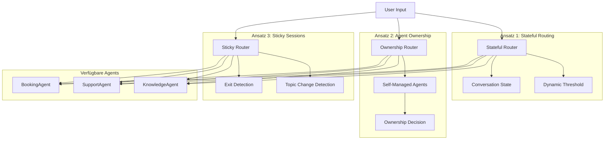
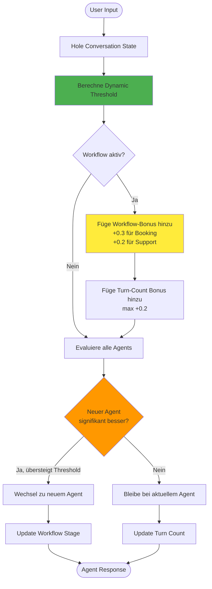
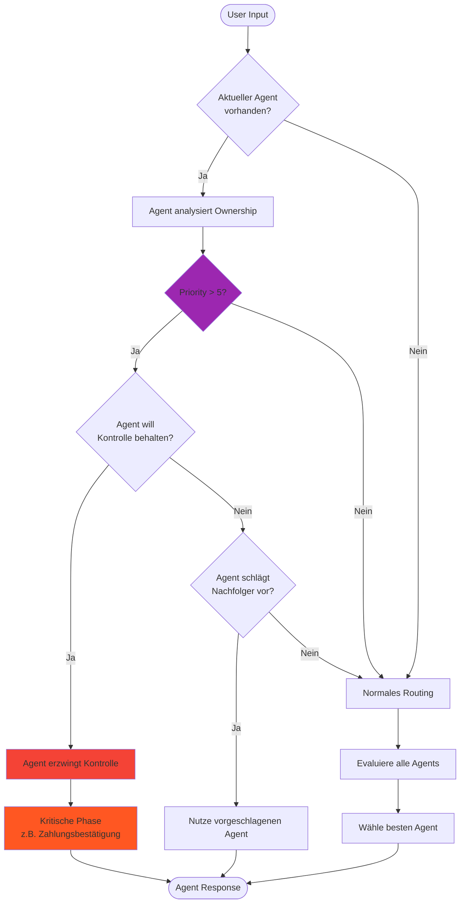
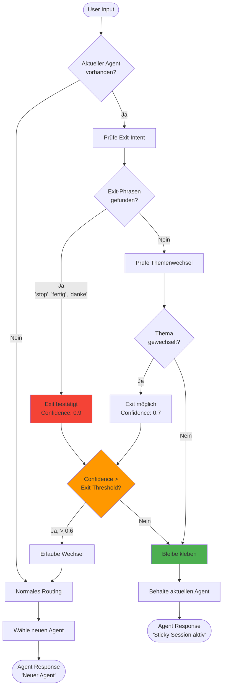
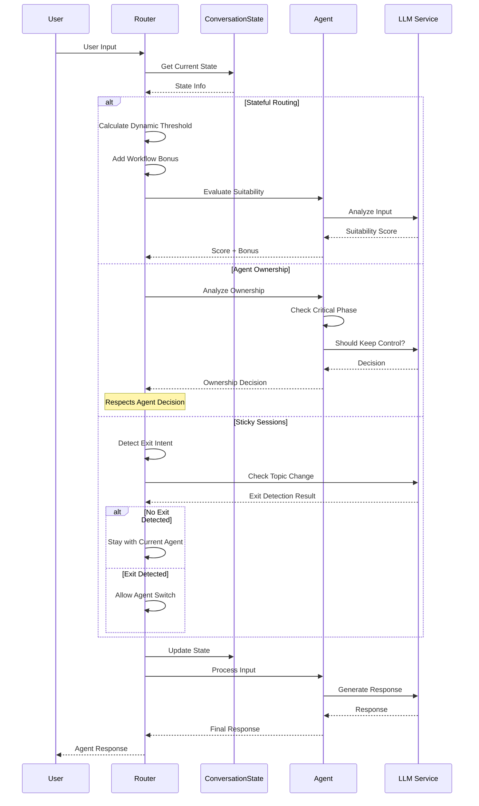
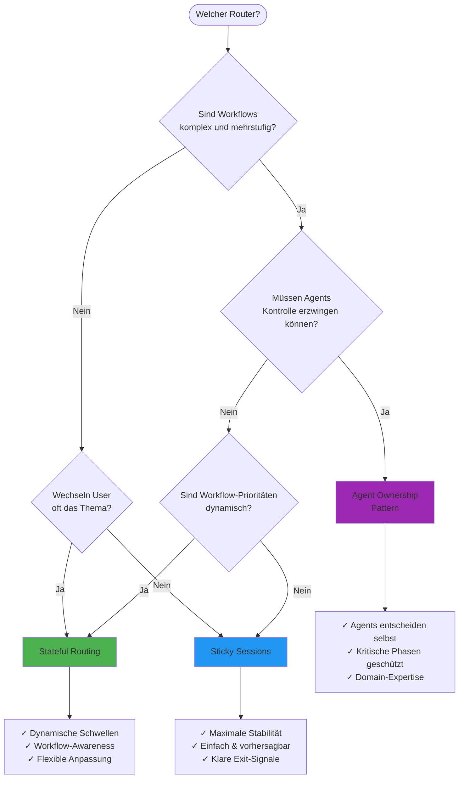
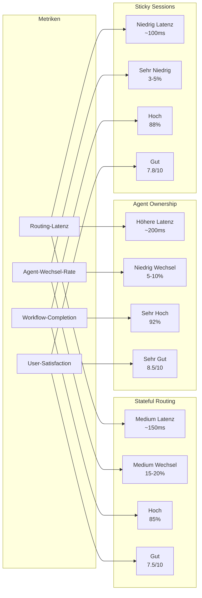
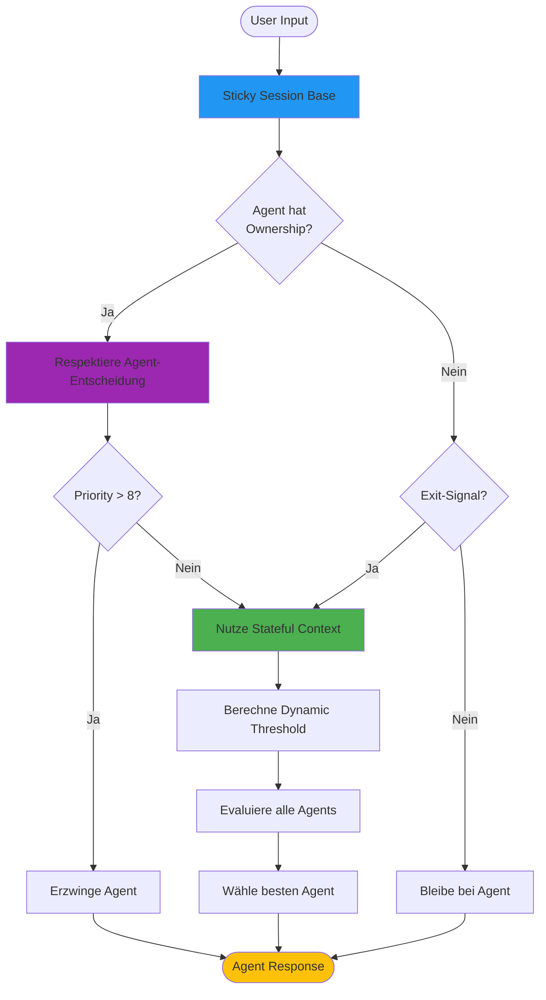

# Router-Architekturen Visualisierung

## Übersicht: Die drei Router-Ansätze

## Ansatz 1: Stateful Routing Ablauf

## Ansatz 2: Agent Ownership Flow

## Ansatz 3: Sticky Sessions Mechanismus

## Interaktion zwischen Komponenten

## Entscheidungsbaum für Router-Auswahl

## Performance-Vergleich

## Hybrid-Router Konzept

## Zusammenfassung

Die drei Router-Ansätze bieten unterschiedliche Strategien für konsistente Agent-Workflows:

1. **Stateful Routing**: Flexibel und anpassungsfähig durch dynamische Schwellenwerte
2. **Agent Ownership**: Robust und intelligent durch selbstverwaltete Agents
3. **Sticky Sessions**: Stabil und vorhersagbar durch "klebriges" Verhalten

Die Wahl des richtigen Ansatzes hängt vom konkreten Use-Case ab. In der Praxis zeigt sich oft, dass eine Kombination aller drei Ansätze die besten Ergebnisse liefert.